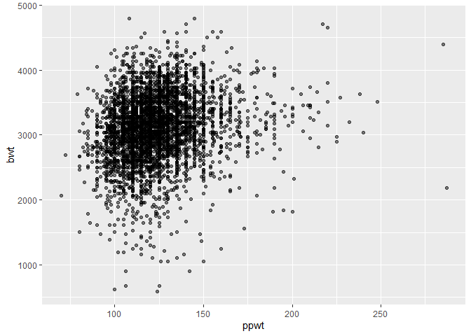

p8105_hw6_hw2850
================

``` r
library(tidyverse)
```

    ## ── Attaching packages ─────────────────────────────────────── tidyverse 1.3.2 ──
    ## ✔ ggplot2 3.3.6      ✔ purrr   0.3.4 
    ## ✔ tibble  3.1.8      ✔ dplyr   1.0.10
    ## ✔ tidyr   1.2.0      ✔ stringr 1.4.1 
    ## ✔ readr   2.1.2      ✔ forcats 0.5.2 
    ## ── Conflicts ────────────────────────────────────────── tidyverse_conflicts() ──
    ## ✖ dplyr::filter() masks stats::filter()
    ## ✖ dplyr::lag()    masks stats::lag()

\###Problem 2

``` r
#read data
homicide = read_csv("data/homicide-data.csv") %>% 
  janitor::clean_names()
```

    ## Rows: 52179 Columns: 12
    ## ── Column specification ────────────────────────────────────────────────────────
    ## Delimiter: ","
    ## chr (9): uid, victim_last, victim_first, victim_race, victim_age, victim_sex...
    ## dbl (3): reported_date, lat, lon
    ## 
    ## ℹ Use `spec()` to retrieve the full column specification for this data.
    ## ℹ Specify the column types or set `show_col_types = FALSE` to quiet this message.

``` r
homicide_tidy = homicide %>% 
  mutate(
    city_state = str_c(city, ", " ,state), #create city_state variable
    disposition = if_else(disposition %in% "Closed by arrest", 1, 0)
    ) %>% #make disposition a binary variable
  filter(!city_state %in% c("Dallas, TX", "Phoenix, AZ", "Kansas City, MO", "Tulsa, AL"),
         victim_race %in% c("White", "Black")) %>% #Only select white & black
  mutate(victim_age = as.numeric(victim_age), #make age numeric
         victim_race = fct_relevel(victim_race, "White"),
         disposition = as.numeric(disposition)) %>% 
  select(!c(city, state))
```

    ## Warning in mask$eval_all_mutate(quo): NAs introduced by coercion

``` r
Baltimore = homicide_tidy %>% 
  filter(city_state == "Baltimore, MD") #get Baltimore data

Baltimore_fit = Baltimore %>% 
  glm(disposition ~ victim_age + victim_sex + victim_race, data = ., family = binomial()) #run glm

Baltimore_results = Baltimore_fit %>% 
  broom::tidy(conf.int = T) %>% 
  mutate(OR = exp(estimate)) %>%
  select(term, log_OR = estimate, OR, p.value, conf.low, conf.high) 
```

``` r
homicide_nest = homicide_tidy %>% 
  select(city_state, victim_race, victim_age, victim_sex, disposition) %>%
  nest(data = -city_state) %>% #nest data and run glm on each city
  mutate(models = map(data, ~glm(disposition ~ victim_age + victim_sex + victim_race, data = .x, family = binomial())),
         results = map(models, ~broom::tidy(x = .x, conf.int = T))) %>% 
  select(-data, -models) %>% 
  unnest(results) %>% 
  filter(term %in% "victim_sexMale") %>% #only need sex coefficients
  mutate(OR = exp(estimate),
         conf.low = exp(conf.low),
         conf.high = exp(conf.high))
```

    ## Warning: glm.fit: fitted probabilities numerically 0 or 1 occurred

    ## Warning: glm.fit: fitted probabilities numerically 0 or 1 occurred

    ## Warning: glm.fit: fitted probabilities numerically 0 or 1 occurred

    ## Warning: glm.fit: fitted probabilities numerically 0 or 1 occurred

    ## Warning: glm.fit: fitted probabilities numerically 0 or 1 occurred

    ## Warning: glm.fit: fitted probabilities numerically 0 or 1 occurred

    ## Warning: glm.fit: fitted probabilities numerically 0 or 1 occurred

    ## Warning: glm.fit: fitted probabilities numerically 0 or 1 occurred

    ## Warning: glm.fit: fitted probabilities numerically 0 or 1 occurred

    ## Warning: glm.fit: fitted probabilities numerically 0 or 1 occurred

    ## Warning: glm.fit: fitted probabilities numerically 0 or 1 occurred

    ## Warning: glm.fit: fitted probabilities numerically 0 or 1 occurred

    ## Warning: glm.fit: fitted probabilities numerically 0 or 1 occurred

    ## Warning: glm.fit: fitted probabilities numerically 0 or 1 occurred

    ## Warning: glm.fit: fitted probabilities numerically 0 or 1 occurred

    ## Warning: glm.fit: fitted probabilities numerically 0 or 1 occurred

    ## Warning: glm.fit: fitted probabilities numerically 0 or 1 occurred

    ## Warning: glm.fit: fitted probabilities numerically 0 or 1 occurred

    ## Warning: glm.fit: fitted probabilities numerically 0 or 1 occurred

    ## Warning: glm.fit: fitted probabilities numerically 0 or 1 occurred

    ## Warning: glm.fit: fitted probabilities numerically 0 or 1 occurred

    ## Warning: glm.fit: fitted probabilities numerically 0 or 1 occurred

    ## Warning: glm.fit: fitted probabilities numerically 0 or 1 occurred

    ## Warning: glm.fit: fitted probabilities numerically 0 or 1 occurred

    ## Warning: glm.fit: fitted probabilities numerically 0 or 1 occurred

    ## Warning: glm.fit: fitted probabilities numerically 0 or 1 occurred

    ## Warning: glm.fit: fitted probabilities numerically 0 or 1 occurred

    ## Warning: glm.fit: fitted probabilities numerically 0 or 1 occurred

    ## Warning: glm.fit: fitted probabilities numerically 0 or 1 occurred

    ## Warning: glm.fit: fitted probabilities numerically 0 or 1 occurred

    ## Warning: glm.fit: fitted probabilities numerically 0 or 1 occurred

    ## Warning: glm.fit: fitted probabilities numerically 0 or 1 occurred

    ## Warning: glm.fit: fitted probabilities numerically 0 or 1 occurred

    ## Warning: glm.fit: fitted probabilities numerically 0 or 1 occurred

    ## Warning: glm.fit: fitted probabilities numerically 0 or 1 occurred

    ## Warning: glm.fit: fitted probabilities numerically 0 or 1 occurred

    ## Warning: glm.fit: fitted probabilities numerically 0 or 1 occurred

    ## Warning: glm.fit: fitted probabilities numerically 0 or 1 occurred

    ## Warning: glm.fit: fitted probabilities numerically 0 or 1 occurred

    ## Warning: glm.fit: fitted probabilities numerically 0 or 1 occurred

    ## Warning: glm.fit: fitted probabilities numerically 0 or 1 occurred

    ## Warning: glm.fit: fitted probabilities numerically 0 or 1 occurred

    ## Warning: glm.fit: fitted probabilities numerically 0 or 1 occurred

``` r
homicide_plot = homicide_nest %>% 
  ggplot(aes(x = OR, y = reorder(city_state, OR)))+
  geom_point()+
  geom_errorbar(aes(xmin = conf.low, xmax = conf.high))+
  labs(
    title = "Adjusted OR and CI for Solving Homicides Comparing Victims Gender",
    x = "Odds Ratio",
    y = "City_State"
  )

homicide_plot
```

<!-- -->

\###Problem 3

``` r
birthwt = read_csv("data/birthweight.csv") %>% 
  janitor::clean_names()
```

    ## Rows: 4342 Columns: 20
    ## ── Column specification ────────────────────────────────────────────────────────
    ## Delimiter: ","
    ## dbl (20): babysex, bhead, blength, bwt, delwt, fincome, frace, gaweeks, malf...
    ## 
    ## ℹ Use `spec()` to retrieve the full column specification for this data.
    ## ℹ Specify the column types or set `show_col_types = FALSE` to quiet this message.

Interested in investigating the relationship between mother’s
pre-pregnancy weight (ppwt) and baby’s birth weight.

``` r
birthwt %>% 
  ggplot(aes(x = ppwt, y = bwt)) +
  geom_point(alpha = .5) #plot the trend between ppwt and bwt
```

<!-- -->
From the graph, there could be a linear relationship between ppwt and
bwt. Therefore, lets fit a simple linear regression model.

``` r
#fit a SLR model
linear_mod = lm(bwt ~ ppwt, data = birthwt)
```
