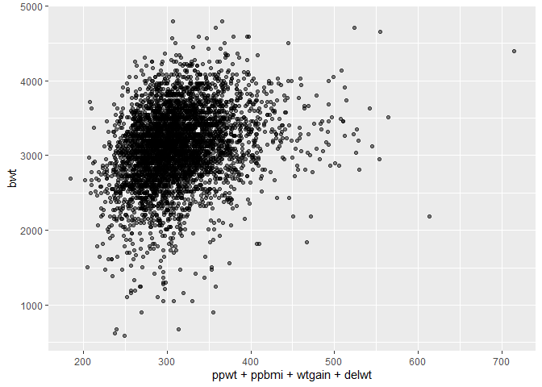
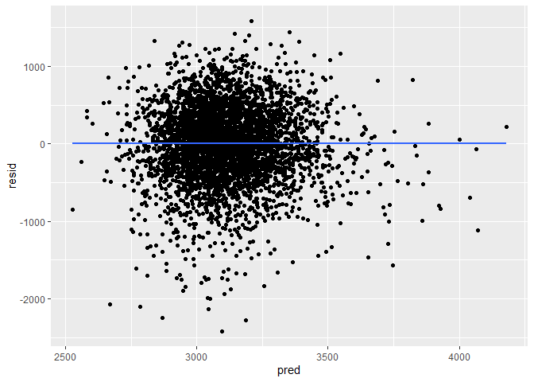

p8105_hw6_hw2850
================

``` r
library(tidyverse)
```

    ## ── Attaching packages ─────────────────────────────────────── tidyverse 1.3.2 ──
    ## ✔ ggplot2 3.3.6      ✔ purrr   0.3.4 
    ## ✔ tibble  3.1.8      ✔ dplyr   1.0.10
    ## ✔ tidyr   1.2.0      ✔ stringr 1.4.1 
    ## ✔ readr   2.1.2      ✔ forcats 0.5.2 
    ## ── Conflicts ────────────────────────────────────────── tidyverse_conflicts() ──
    ## ✖ dplyr::filter() masks stats::filter()
    ## ✖ dplyr::lag()    masks stats::lag()

\###Problem 2

``` r
#read data
homicide = read_csv("data/homicide-data.csv") %>% 
  janitor::clean_names()
```

    ## Rows: 52179 Columns: 12
    ## ── Column specification ────────────────────────────────────────────────────────
    ## Delimiter: ","
    ## chr (9): uid, victim_last, victim_first, victim_race, victim_age, victim_sex...
    ## dbl (3): reported_date, lat, lon
    ## 
    ## ℹ Use `spec()` to retrieve the full column specification for this data.
    ## ℹ Specify the column types or set `show_col_types = FALSE` to quiet this message.

``` r
homicide_tidy = homicide %>% 
  mutate(
    city_state = str_c(city, ", " ,state), #create city_state variable
    disposition = if_else(disposition %in% "Closed by arrest", 1, 0)
    ) %>% #make disposition a binary variable
  filter(!city_state %in% c("Dallas, TX", "Phoenix, AZ", "Kansas City, MO", "Tulsa, AL"),
         victim_race %in% c("White", "Black")) %>% #Only select white & black
  mutate(victim_age = as.numeric(victim_age), #make age numeric
         victim_race = fct_relevel(victim_race, "White"),
         disposition = as.numeric(disposition)) %>% 
  select(!c(city, state))
```

    ## Warning in mask$eval_all_mutate(quo): NAs introduced by coercion

``` r
Baltimore = homicide_tidy %>% 
  filter(city_state == "Baltimore, MD") #get Baltimore data

Baltimore_fit = Baltimore %>% 
  glm(disposition ~ victim_age + victim_sex + victim_race, data = ., family = binomial()) #run glm

Baltimore_results = Baltimore_fit %>% 
  broom::tidy(conf.int = T) %>% 
  mutate(OR = exp(estimate)) %>%
  select(term, log_OR = estimate, OR, p.value, conf.low, conf.high) 
```

``` r
homicide_nest = homicide_tidy %>% 
  select(city_state, victim_race, victim_age, victim_sex, disposition) %>%
  nest(data = -city_state) %>% #nest data and run glm on each city
  mutate(models = map(data, ~glm(disposition ~ victim_age + victim_sex + victim_race, data = .x, family = binomial())),
         results = map(models, ~broom::tidy(x = .x, conf.int = T))) %>% 
  select(-data, -models) %>% 
  unnest(results) %>% 
  filter(term %in% "victim_sexMale") %>% #only need sex coefficients
  mutate(OR = exp(estimate),
         conf.low = exp(conf.low),
         conf.high = exp(conf.high))
```

    ## Warning: glm.fit: fitted probabilities numerically 0 or 1 occurred

    ## Warning: glm.fit: fitted probabilities numerically 0 or 1 occurred

    ## Warning: glm.fit: fitted probabilities numerically 0 or 1 occurred

    ## Warning: glm.fit: fitted probabilities numerically 0 or 1 occurred

    ## Warning: glm.fit: fitted probabilities numerically 0 or 1 occurred

    ## Warning: glm.fit: fitted probabilities numerically 0 or 1 occurred

    ## Warning: glm.fit: fitted probabilities numerically 0 or 1 occurred

    ## Warning: glm.fit: fitted probabilities numerically 0 or 1 occurred

    ## Warning: glm.fit: fitted probabilities numerically 0 or 1 occurred

    ## Warning: glm.fit: fitted probabilities numerically 0 or 1 occurred

    ## Warning: glm.fit: fitted probabilities numerically 0 or 1 occurred

    ## Warning: glm.fit: fitted probabilities numerically 0 or 1 occurred

    ## Warning: glm.fit: fitted probabilities numerically 0 or 1 occurred

    ## Warning: glm.fit: fitted probabilities numerically 0 or 1 occurred

    ## Warning: glm.fit: fitted probabilities numerically 0 or 1 occurred

    ## Warning: glm.fit: fitted probabilities numerically 0 or 1 occurred

    ## Warning: glm.fit: fitted probabilities numerically 0 or 1 occurred

    ## Warning: glm.fit: fitted probabilities numerically 0 or 1 occurred

    ## Warning: glm.fit: fitted probabilities numerically 0 or 1 occurred

    ## Warning: glm.fit: fitted probabilities numerically 0 or 1 occurred

    ## Warning: glm.fit: fitted probabilities numerically 0 or 1 occurred

    ## Warning: glm.fit: fitted probabilities numerically 0 or 1 occurred

    ## Warning: glm.fit: fitted probabilities numerically 0 or 1 occurred

    ## Warning: glm.fit: fitted probabilities numerically 0 or 1 occurred

    ## Warning: glm.fit: fitted probabilities numerically 0 or 1 occurred

    ## Warning: glm.fit: fitted probabilities numerically 0 or 1 occurred

    ## Warning: glm.fit: fitted probabilities numerically 0 or 1 occurred

    ## Warning: glm.fit: fitted probabilities numerically 0 or 1 occurred

    ## Warning: glm.fit: fitted probabilities numerically 0 or 1 occurred

    ## Warning: glm.fit: fitted probabilities numerically 0 or 1 occurred

    ## Warning: glm.fit: fitted probabilities numerically 0 or 1 occurred

    ## Warning: glm.fit: fitted probabilities numerically 0 or 1 occurred

    ## Warning: glm.fit: fitted probabilities numerically 0 or 1 occurred

    ## Warning: glm.fit: fitted probabilities numerically 0 or 1 occurred

    ## Warning: glm.fit: fitted probabilities numerically 0 or 1 occurred

    ## Warning: glm.fit: fitted probabilities numerically 0 or 1 occurred

    ## Warning: glm.fit: fitted probabilities numerically 0 or 1 occurred

    ## Warning: glm.fit: fitted probabilities numerically 0 or 1 occurred

    ## Warning: glm.fit: fitted probabilities numerically 0 or 1 occurred

    ## Warning: glm.fit: fitted probabilities numerically 0 or 1 occurred

    ## Warning: glm.fit: fitted probabilities numerically 0 or 1 occurred

    ## Warning: glm.fit: fitted probabilities numerically 0 or 1 occurred

    ## Warning: glm.fit: fitted probabilities numerically 0 or 1 occurred

``` r
homicide_plot = homicide_nest %>% 
  ggplot(aes(x = OR, y = reorder(city_state, OR)))+
  geom_point()+
  geom_errorbar(aes(xmin = conf.low, xmax = conf.high))+
  labs(
    title = "Adjusted OR and CI for Solving Homicides Comparing Victims Gender",
    x = "Odds Ratio",
    y = "City_State"
  )

homicide_plot
```

<!-- -->

\###Problem 3

``` r
#load packages
library(modelr)
library(mgcv)
```

    ## Loading required package: nlme

    ## 
    ## Attaching package: 'nlme'

    ## The following object is masked from 'package:dplyr':
    ## 
    ##     collapse

    ## This is mgcv 1.8-40. For overview type 'help("mgcv-package")'.

``` r
#load data
birthwt = read_csv("data/birthweight.csv") %>% 
  janitor::clean_names()
```

    ## Rows: 4342 Columns: 20
    ## ── Column specification ────────────────────────────────────────────────────────
    ## Delimiter: ","
    ## dbl (20): babysex, bhead, blength, bwt, delwt, fincome, frace, gaweeks, malf...
    ## 
    ## ℹ Use `spec()` to retrieve the full column specification for this data.
    ## ℹ Specify the column types or set `show_col_types = FALSE` to quiet this message.

Interested in investigating the relationship between mother’s
pre-pregnancy weight (ppwt) and baby’s birth weight because mother’s
pre-pregnancy weight could be an indicator of mothers’ health condition
and this may affect their newborns weight.

``` r
birthwt %>% 
  ggplot(aes(x = ppwt, y = bwt)) +
  geom_point(alpha = .5) #plot the trend between ppwt and bwt
```

<!-- -->
From the graph we can see that there is not a clear linear relationship
between ppwt and bwt. But let’s try fit a simple linear regression
between mother’s pre-pregnancy weight and baby’s birth weight anyways.

``` r
#fit a SLR model
linear_mod = lm(bwt ~ ppwt, data = birthwt)
linear_mod %>% 
  broom::tidy()
```

    ## # A tibble: 2 × 5
    ##   term        estimate std.error statistic  p.value
    ##   <chr>          <dbl>     <dbl>     <dbl>    <dbl>
    ## 1 (Intercept)  2541.      47.4        53.6 0       
    ## 2 ppwt            4.65     0.379      12.3 5.69e-34

``` r
birthwt_plot = birthwt %>% 
  modelr::add_residuals(linear_mod) %>% #add residuals
  modelr::add_predictions(linear_mod) %>% #add predictions
  ggplot(aes(x = pred, y = resid))+
  geom_point()+
  geom_smooth(se = F, method = "lm")

birthwt_plot #plot residuals against fitted values
```

    ## `geom_smooth()` using formula 'y ~ x'

<!-- -->
The plot does not has a random pattern and evenly distributed around 0,
which may indicate the model does not meet homoscedasticity.

``` r
#run MLR model with length at birth and gestational age
mlr_mod = lm(bwt ~ blength + gaweeks, data = birthwt) 
summary(mlr_mod)
```

    ## 
    ## Call:
    ## lm(formula = bwt ~ blength + gaweeks, data = birthwt)
    ## 
    ## Residuals:
    ##     Min      1Q  Median      3Q     Max 
    ## -1709.6  -215.4   -11.4   208.2  4188.8 
    ## 
    ## Coefficients:
    ##              Estimate Std. Error t value Pr(>|t|)    
    ## (Intercept) -4347.667     97.958  -44.38   <2e-16 ***
    ## blength       128.556      1.990   64.60   <2e-16 ***
    ## gaweeks        27.047      1.718   15.74   <2e-16 ***
    ## ---
    ## Signif. codes:  0 '***' 0.001 '**' 0.01 '*' 0.05 '.' 0.1 ' ' 1
    ## 
    ## Residual standard error: 333.2 on 4339 degrees of freedom
    ## Multiple R-squared:  0.5769, Adjusted R-squared:  0.5767 
    ## F-statistic:  2958 on 2 and 4339 DF,  p-value: < 2.2e-16

``` r
#run MLR model with head circumference, length, sex and their interactions
inter_mod = lm(bwt ~ bhead*blength*babysex, data = birthwt)
summary(inter_mod)
```

    ## 
    ## Call:
    ## lm(formula = bwt ~ bhead * blength * babysex, data = birthwt)
    ## 
    ## Residuals:
    ##      Min       1Q   Median       3Q      Max 
    ## -1132.99  -190.42   -10.33   178.63  2617.96 
    ## 
    ## Coefficients:
    ##                         Estimate Std. Error t value Pr(>|t|)    
    ## (Intercept)           -13551.685   2759.413  -4.911 9.39e-07 ***
    ## bhead                    380.189     83.395   4.559 5.28e-06 ***
    ## blength                  225.900     57.398   3.936 8.43e-05 ***
    ## babysex                 6374.868   1677.767   3.800 0.000147 ***
    ## bhead:blength             -4.432      1.715  -2.583 0.009815 ** 
    ## bhead:babysex           -198.393     51.092  -3.883 0.000105 ***
    ## blength:babysex         -123.773     35.119  -3.524 0.000429 ***
    ## bhead:blength:babysex      3.878      1.057   3.670 0.000245 ***
    ## ---
    ## Signif. codes:  0 '***' 0.001 '**' 0.01 '*' 0.05 '.' 0.1 ' ' 1
    ## 
    ## Residual standard error: 287.7 on 4334 degrees of freedom
    ## Multiple R-squared:  0.6849, Adjusted R-squared:  0.6844 
    ## F-statistic:  1346 on 7 and 4334 DF,  p-value: < 2.2e-16

``` r
#cross validation between models
cv_df =
  crossv_mc(birthwt, 1000) %>% 
  mutate(
    train = map(train, as_tibble),
    test = map(test, as_tibble))
```

``` r
#get corresponding RMSEs for the testing data 
cv_df = 
  cv_df %>% 
  mutate(
    linear_mod  = map(train, ~lm(bwt ~ ppwt, data = .x)),
    mlr_mod     = map(train, ~lm(bwt ~ blength + gaweeks, data = .x)),
    inter_mod   = map(train, ~lm(bwt ~ bhead*blength*babysex, data = as_tibble(.x)))) %>% 
  mutate(
    rmse_linear = map2_dbl(linear_mod, test, ~rmse(model = .x, data = .y)),
    rmse_mlr    = map2_dbl(mlr_mod, test, ~rmse(model = .x, data = .y)),
    rmse_inter  = map2_dbl(inter_mod, test, ~rmse(model = .x, data = .y)))
```

``` r
#plot the prediction error distribution for each candidate model
cv_df %>% 
  select(starts_with("rmse")) %>% 
  pivot_longer(
    everything(),
    names_to = "model", 
    values_to = "rmse",
    names_prefix = "rmse_") %>% 
  mutate(model = fct_inorder(model)) %>% 
  ggplot(aes(x = model, y = rmse)) + geom_violin()
```

<!-- -->
From the graph, we can clearly see that the RMSEs for linear model are
significantly higher than the MLR model and Interaction model.
Therefore, fitting ppwt and bwt with a simple linear model is definately
not ideal. Between MLR model and Interaction model, the latter one has
lower rmse. Therefore, baby’s head circumference, length, and sex are
interacting with each other and the Interaction model is better than the
MLR model with length at birth and gestational age as predictors.
